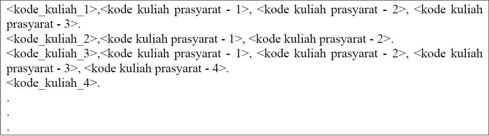
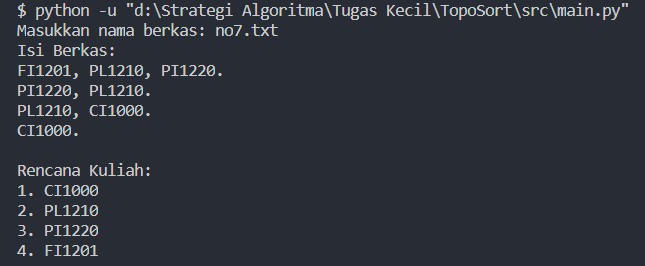

# Tugas Kecil 2 IF2211 Strategi Algoritma

## Penjelasan Program
Program Python untuk melakukan Topological Sort yang merupakan penerapan algoritma Decrease and Conquer. Algoritma yang dibuat mengecek simpul secara rekursif. Tahap pengecekan sebagai berikut:

1. Mengecek simpul yang dimasukkan sebagai parameter.
2. Mengiterasi setiap simpul tetangga yang ada di list tetangga:
    * Jika simpul tetangga belum pernah dikunjungi, masukkan ke dalam himpunan simpul lalu panggil fungsi recursiveSortHelper untuk mengecek simpul tersebut.
    * Jika pernah dikunjungi, lompati.
3. Jika simpul yang dimasukkan sebagai parameter belum di dalam list solusi, masukkan simpul tersebut ke dalam list.


## Requirement
- python 3.9.0

## Cara Menggunakan Program
1. Buatlah file txt berisi daftar kuliah beserta kuliah prasyaratnya pada folder test. Contoh input sebagai berikut:

2. Jalankan program, dari directory root masukkan input sebagai berikut:
```bash
python bin/13519140.py
```
3. Input nama file txt yang akan hasil topological sortnya.
4. Tunggu beberapa saat dan solusi sebagai berikut akan ditampilkan di command line.


## Kontributor
Fabian Savero Diaz Pranoto (13519140)
